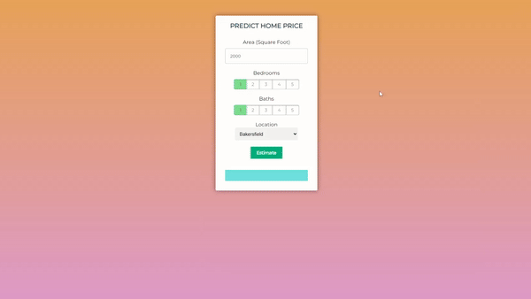

## Previsão de Preço de Casas

[Go to the english description](https://github.com/Anotherafael/STUDY_HousePricePrediction)

Este aplicativo web utiliza um modelo de previsão linear para analisar o conjunto de dados de Preços de Casas nos EUA, que pode ser acessado no [Kaggle](https://www.kaggle.com/datasets/ahmedshahriarsakib/usa-real-estate-dataset).

O modelo treinado pode prever o preço de uma casa com base em critérios como localização, número de quartos, número de banheiros e tamanho do lote. É importante notar que as previsões são válidas apenas para áreas específicas da Califórnia.

## Como Funciona?

## Tecnologias

* **Python:** desenvolvimento backend e construção do modelo de aprendizado de máquina.
* **Numpy e Pandas:** pré-processamento de dados, engenharia de recursos e manipulação de conjuntos de dados.
* **Sklearn:** implementar o modelo Random Forest para predição.
* **Matplotlib e Plotly:**  visualização de dados.
* **Flask:** construir da aplicação web.
* **Docker:** containerizar os serviços.
